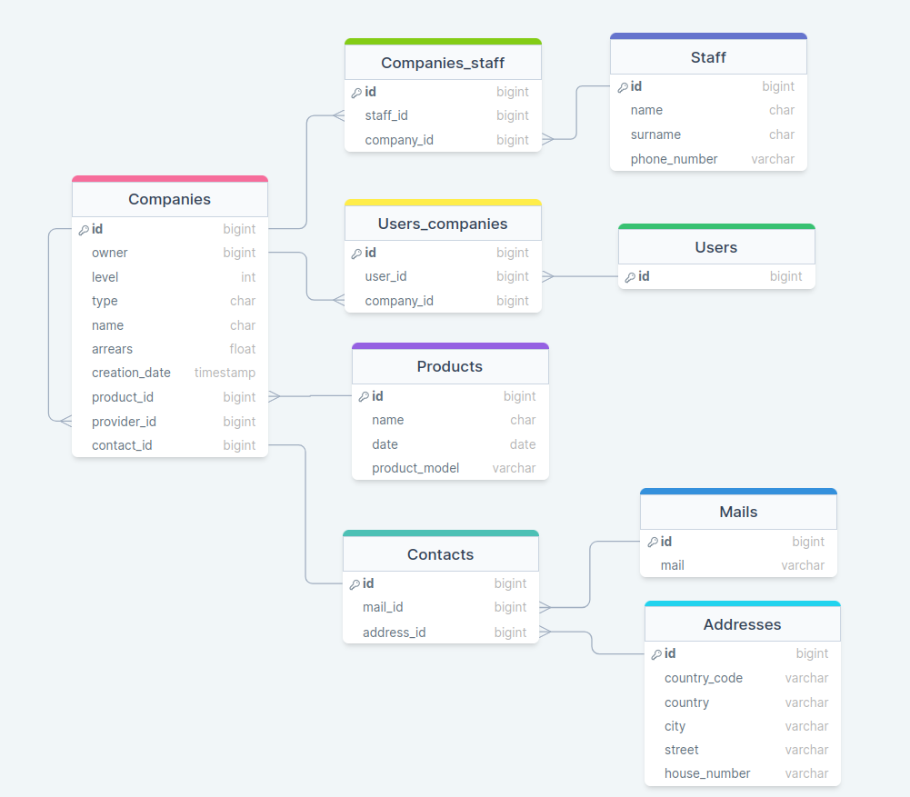
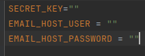
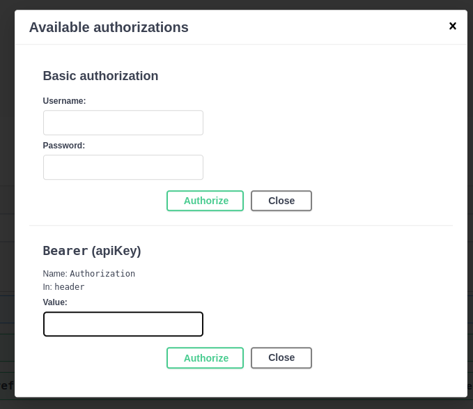

# Платформа сети электроники


## Описание проекта
***
В проекте присутствует 5 приложений:
- staff (таблица Staff)
- products (таблица Products)
- contacts (таблицы Address, Email, Contacts)
- companies (таблица Companies)
- electronics_api (DRF API)

Вся информация о таблицах БД и связях между ними представлена на диаграмме ниже и по ссылке (<https://drawsql.app/teams/my-team-1021/diagrams/electronics>).



Таблицу заполнял с помощью библиотеки mimesis. Для этого определил в каждой модели метод **_fill__test_objects** и
настроил его под каждое поле.

## Как развернуть приложение
***
Для развертывания приложение используется docker-compose файл.

Команды для установки:
```bash
$ git clone https://github.com/YourBobi/SupportTask.git
```
После клонирования директория создайте .env файл в корневой папке проекта Electronics. После заполните следующие поля:



Запустите докер:

```bash
$ docker-compose build
$ docker-compose up
```

Для создания таблиц использовать команды:
```bash
$ docker-compose run --rm web-app sh -c "python manage.py migrate"
$ docker-compose run --rm web-app sh -c "python manage.py makemigrations products"
$ docker-compose run --rm web-app sh -c "python manage.py makemigrations staff"
$ docker-compose run --rm web-app sh -c "python manage.py makemigrations contacts"
$ docker-compose run --rm web-app sh -c "python manage.py makemigrations companies"
$ docker-compose run --rm web-app sh -c "python manage.py migrate"
$ docker-compose run --rm web-app sh -c "python manage.py createsuperuser"
```
Заполнение БД (по порядку):
```bash
$ docker-compose run --rm web-app sh -c "python manage.py fill_product"
$ docker-compose run --rm web-app sh -c "python manage.py fill_staff"
$ docker-compose run --rm web-app sh -c "python manage.py fill_address"
$ docker-compose run --rm web-app sh -c "python manage.py fill_email"
$ docker-compose run --rm web-app sh -c "python manage.py fill_contacts"
$ docker-compose run --rm web-app sh -c "python manage.py fill_users"
$ docker-compose run --rm web-app sh -c "python manage.py fill_companies"
```

**Приложение готово к работе**

## Описание заданий по пунктам
***
1. Модель электроники представлена в таблице выше.


2. На что стоит обратить внимание. Основная модель это Companies. Поле owner имеет связь ManyToMany чтобы можно было 
прикрутить экшн назначения доступов к компаниям. В классе определен метод save_user который надо вызывать каждый раз 
перед сохранением owners. Переопределять стандартный метод save() не стал т.к. это плохая практика.


3. Представление компаний данных в админке производится в файле ./companies/admin.py

    - Ссылка на поставщика представлена с помощью метода view_provider_links() класса CompanyAdmin.

    - Фильтр по названию города представлен в файле ./companies/custom_filters.py. В классе CompanyAdmin он вызывается следующим образом:

    - Экшен очищения задолженности представлен методом clear_arrears()
    
    Так же был переопределен метод save_model() для дефолтного заполнения owner.


4. DRF - приложение electronics_api. Использовал viewsets для представления сериализаторов.

    - Информацию о всех объектах можно получить по ссылке <http://127.0.0.1:8000/electronics_api/companies/>
    - Все фильтры для компаний описаны в файле ./electronics_api/custom_filters.py в классе CompanyFilter. Фильтр по городам реализован через класс AllValuesFilter().
    - Статистику о должниках прикрутил через фильтр с помощью класса AllValuesFilter().
    - Фильтр по id продукта через класс ChoiceFilter() и метод, который вызывается в конструкторе этого класса - filter_company_debt().
    - Возможность создания и удаления сети вшито в viewsets. Для продуктов исключил удаление, т.к. доступ к списку всех продуктов есть у всех.
    - Запретил обновление с помощью класса для serializers.ReadOnlyField().
    - Доступ к апи реализовал с помощью permissions декоратора. Список пользователей доступен только админу. Остальное доступно активным пользователям.


5. Опциональная часть.

    - Заполнение базы данных происходит с помощью пользовательских команд управления в Django. Эти команды вызывают
   метод **_fill__test_objects** определенный в классе каждой модели. Данные подставляются с помощью библиотеки **mimesis**.
    - celery задачи описаны в файлах tasks.py
    - Отправка QR кода производится с помощью экшена get_get_gr() в представлении CompanyViewSet. Сам метод описан в файле 
   ./electronics_api/tasks.py. Данные преобразуются в QR с помощью библиотеки qrcode. QR переводится PIL.Image и сохраняется в BytesIO буфер. При отправке сообщения данные берутся из него и преобразуются в .png.
    - Валидация данных реализована в сериализаторах в файле ./electronics_api/serializers.
    - Пользователи могут получать данные с помощью JWT токенов. Использовал simple_jwt. Проверить его работу можно с помощью swagger введя "Bearer {API_KEY}" в поле авторизации.
   Для того, чтобы пользователь получил данные только о своих объектах, переопределил queryset в view.py/
   
    - Кнопку описал в методе copy_email() в ./companies/admin.py
       ```python
        def copy_email(self, obj):
            return format_html(
                "<a class=\"button\" onclick=\"navigator.clipboard.writeText('{0}');alert('Скопировано');\">{0}</a>",
                obj.contact_id.mail_id,
            )
       ```
## Заключение
***
Все задания были реализованы.